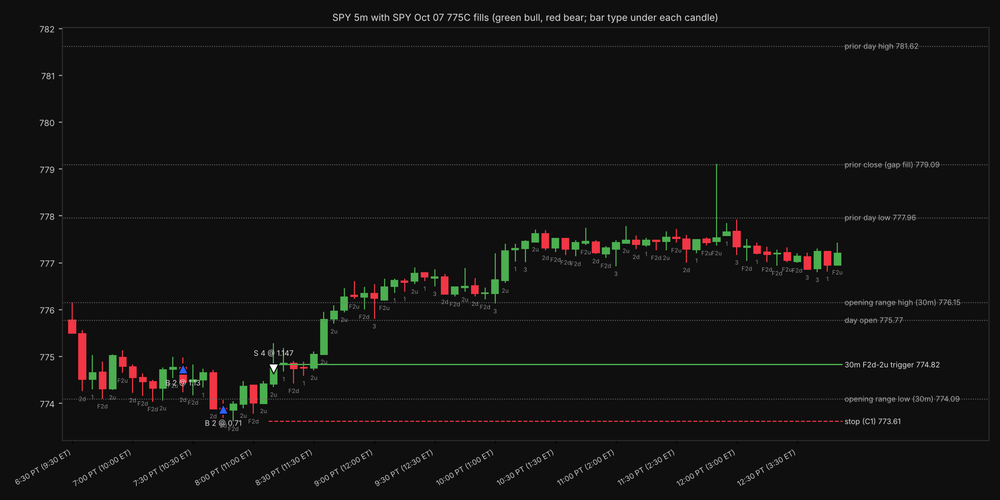

# TheStrat Trade Review, by 345 Strategies

Hand an AI assistant your fills and it reviews the trade the way a TheStrat trader would: where the entry sat against the 5m, 15m, 30m and 60m bars (with the daily for context), whether you were with or against continuity, where the real trigger was, how close you came to your daily loss limit, and what holding, a runner, scaling out at target or the clean trigger entry would actually have paid. Works for **options, shares and futures**, from **any broker**.

## What you need

- Your fills, by any of these routes: a connected broker, your broker's export file as-is, or a pasted or screenshotted order history. Exports from Schwab/thinkorswim, Interactive Brokers, Tradovate, NinjaTrader, Webull, Robinhood, Public and Alpaca are recognized automatically. [How to get yours](skills/strat-trade-review/references/connect-and-import.md)
- Price bars. Free by default through Yahoo Finance; broker, TradingView and paid sources are listed in [data sources](skills/strat-trade-review/references/data-sources.md).

## Install

| Where you use AI | Install |
|---|---|
| **Claude (claude.ai, desktop, mobile)** | Download [`dist/strat-trade-review.zip`](https://github.com/natebking/strat-trade-review/raw/main/dist/strat-trade-review.zip), then Settings > Capabilities > Skills > Upload skill. Code execution must be on. |
| **Claude Code** | `/plugin marketplace add natebking/strat-trade-review`, then `/plugin install strat-trade-review@strat-trade-review`. Or copy `skills/strat-trade-review` into `~/.claude/skills/`. |
| **ChatGPT, with Skills on your plan** | Upload the same [`dist/strat-trade-review.zip`](https://github.com/natebking/strat-trade-review/raw/main/dist/strat-trade-review.zip) as a skill. |
| **ChatGPT, Custom GPT** | Follow [chatgpt/README.md](chatgpt/README.md): paste the instructions, upload two scripts, turn on Code Interpreter. |
| **Codex and other agents that read `SKILL.md`** | Copy `skills/strat-trade-review` into the agent's skills folder. |
| **Just Python** | `python3 skills/strat-trade-review/scripts/strat_review.py --fills my_export.csv --fetch yfinance --yf-symbol SPY --chart` |

Then ask: *"Review my SPY calls from today"* and attach your export.

## What you get

- A table of every fill with the underlying price at that moment
- TheStrat state (`C1-CC` combos like `F2d-2u`) and continuity on each timeframe at each fill
- Flags: scaled in, averaged down, against continuity, against full continuity, early session
- Every trigger of the session, with stop, target, and whether it worked
- The day's worst point against your loss limit
- Priced alternatives in dollars and R, labeled as real marks or estimates
- A chart in TheStrat Suite bar-type colors (green 2u, red 2d; green and red are bull and bear, never good and bad)

## Method

Bar classification follows [TheStrat Suite](https://github.com/natebking/thestrat-suite) v3.1.x and its TheStratGrammar spec. Summary in [strat-primer.md](skills/strat-trade-review/references/strat-primer.md).

## Not advice

This reviews what happened against a stated method. It does not recommend trades.

## Maintaining

This repo is the single source of truth; the 345 Strategies site links here rather than hosting a copy. Edit files under `skills/strat-trade-review/`, then run `python3 tools/build_zip.py` to rebuild `dist/strat-trade-review.zip`.
