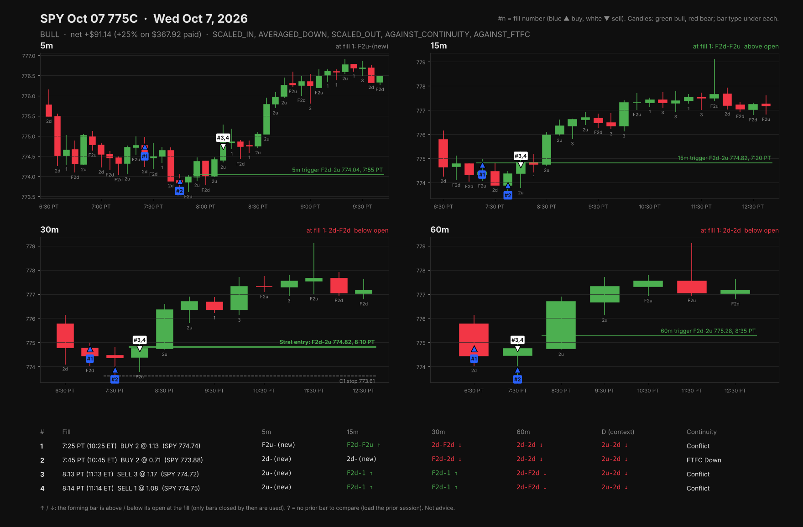

# TheStrat Trade Review, by 345 Strategies

Two skills in one kit: **strat-trade-review** reviews a day's trades against TheStrat, and **trading-risk-and-mindset** coaches the sizing, loss limits and discipline around them.

Hand an AI assistant your fills and it reviews the trade the way a TheStrat trader would: where the entry sat against the 5m, 15m, 30m and 60m bars (with the daily for context), whether you were with or against continuity, where the real trigger was, how close you came to your daily loss limit, and what holding, a runner, scaling out at target or the clean trigger entry would actually have paid. Works for **options, shares and futures**, from **any broker**.

## What you need

- Your fills, by any of these routes: a connected broker, your broker's export file as-is, or a pasted or screenshotted order history. Exports from Schwab/thinkorswim, Interactive Brokers, Tradovate, NinjaTrader, Webull, Robinhood, Public and Alpaca are recognized automatically. [How to get yours](skills/strat-trade-review/references/connect-and-import.md)
- Price bars, free: from a broker you already use (Public, Tradier and Alpaca include option contract bars) or from Yahoo Finance with no account. TradingView and paid sources are also covered in [data sources](skills/strat-trade-review/references/data-sources.md).

## Install

| Where you use AI | Install |
|---|---|
| **Claude (claude.ai, desktop, mobile)** | Download [`strat-trade-review.zip`](https://github.com/natebking/strat-trade-review/raw/main/dist/strat-trade-review.zip) and [`trading-risk-and-mindset.zip`](https://github.com/natebking/strat-trade-review/raw/main/dist/trading-risk-and-mindset.zip), then Settings > Capabilities > Skills > Upload skill for each. Code execution must be on. |
| **Claude Code** | `/plugin marketplace add natebking/strat-trade-review`, then `/plugin install strat-trade-review@strat-trade-review`. Installs both skills and the `/strat-review` command. Or copy the folders in `skills/` into `~/.claude/skills/`. |
| **ChatGPT, with Skills on your plan** | Upload the same two zips as skills. |
| **ChatGPT, Custom GPT** | Follow [chatgpt/README.md](chatgpt/README.md): paste the instructions, upload the scripts, turn on Code Interpreter. |
| **Codex and other agents that read `SKILL.md`** | Copy the folders in `skills/` into the agent's skills folder. |
| **Just Python** | `python3 skills/strat-trade-review/scripts/strat_review.py --fills my_export.csv --fetch yfinance --yf-symbol SPY --chart` |

## Run it

One command works everywhere: `/strat-review SYMBOL [DATE] [LOSS LIMIT]`, then attach your export. Date defaults to today; the number is your daily loss limit.

| App | Type |
|---|---|
| **Claude Code** | `/strat-review SPY today 150`. A real slash command once the plugin (or the `skills/` folders) is installed; `/strat-trade-review:strat-review` if another command shares the name. |
| **Claude (claude.ai, desktop, mobile)** | `/strat-review SPY today 150` as a message |
| **ChatGPT, Custom GPT** | `/strat-review SPY today 150` as a message, or tap the conversation starter |
| **ChatGPT, Skills** | `@strat-trade-review SPY today 150` |
| **Codex** | `$strat-trade-review SPY today 150` |

Plain English works too: *"Review my SPY calls from today"* and attach your export. Or: *"How many MES should I trade with a $10k account?"*, *"Help me write a trading plan"*, *"Here are my last 30 trades in R, what's my biggest leak?"*

## What you get

- A table of every fill with the underlying price at that moment
- TheStrat state (`C1-CC` combos like `F2d-2u`) and continuity on each timeframe at each fill
- Flags: scaled in, averaged down, against continuity, against full continuity, early session
- Every trigger of the session, with stop, target, and whether it worked
- The day's worst point against your loss limit
- Priced alternatives in dollars and R, labeled as real marks or estimates
- Your journal entry (type of trade, thesis, primary timeframe and combo, what it created or negated, management, notes), graded line by line against the bars
- **A 5m / 15m / 30m / 60m image with every fill numbered**, the triggers, the clean Strat entry and its C1 stop, and the state on each timeframe at each fill (green candles bull, red bear, bar type labeled underneath)

- A post ready for Discord (under the 2,000-character limit) with the timeframe image and a P/L-style card: big % return (no dollars or size), a Strat scorecard marking each decision with or against the chart, the alternatives, and your reflection. Both images come from HTML templates you can restyle or redesign (see `skills/strat-trade-review/templates/README.md`)

## Risk and mindset

`trading-risk-and-mindset` sizes positions for shares, options and futures from the stop at C1, computes expectancy, streaks and drawdown from your R multiples, simulates risk of ruin, and helps write a one-page trading plan with loss limits and if-then rules. The principles come from Van Tharp, Mark Douglas, Brett Steenbarger, Annie Duke, Kahneman and Tversky and others ([sources](skills/trading-risk-and-mindset/references/sources.md)), mapped onto TheStrat so they never conflict with it ([how](skills/trading-risk-and-mindset/references/strat-fit.md)).

## Method

Bar classification follows [TheStrat Suite](https://github.com/natebking/thestrat-suite) v3.1.x and its TheStratGrammar spec. Summary in [strat-primer.md](skills/strat-trade-review/references/strat-primer.md).

## Not advice

This reviews what happened against a stated method. It does not recommend trades.

## Maintaining

This repo is the single source of truth; the 345 Strategies site links here rather than hosting a copy. Edit files under `skills/`, then run `python3 tools/build_zip.py` to rebuild the zips in `dist/`.
